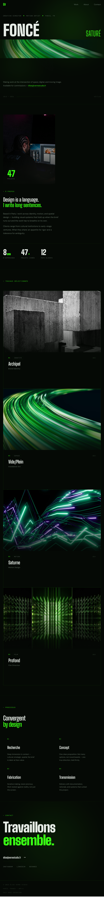
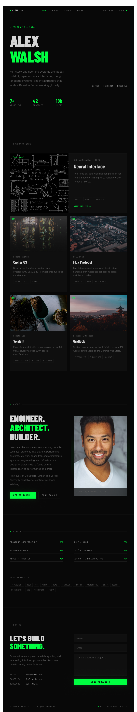

- **Date :** 2026-08-28
- **Prompt :** "Generate a portfolio website example with a green and black color scheme with the following keywords: convergent, juxtaposed, dynamic, Foncé Transparent Saturé Flou"
- **Outil :** Figma Make
- **Résultat :** 

- **Date :** 2026-09-04
- **Prompt :** "Use the image attached as inspiration. Design a portfolio website to showcase projects with a green and black color palette."
- **Outil :** Figma Make
- **Résultat :** 

1. Qu'est-ce que j'ai accompli depuis le dernier bloc?
    J'ai accompli la préproduction et l'organisation du projet, dont la maquette et la planification du portfolio.
2. Quelle a été ma principale difficulté et comment je l'ai surmontée?
    Ma principale difficulté a été de déterminer quel était mon thème personnel sans être cliché. Le vert et noir est une palette de couleur plus ou moins populaire surtout en programmation pour répliquer les anciens terminaux ou un style de « hacker ».
3. Qu'est-ce que j'ai appris que je ne savais pas avant?
    Comment copier de Figma Make à Figma Design.
4. Quelle est ma prochaine étape concrète?
    Ma prochaine étape serait de commencer le layout du site web.
5. Est-ce que j'ai utilisé l'IA? Si oui, pour quoi et qu'est-ce que ça m'a appris?
    Oui. Je l'ai utilisé pour servir d'inspiration pour mon concept. Cela m'a montré ce qui est générique mais également certaines options auquel je n'ai pas pensé.